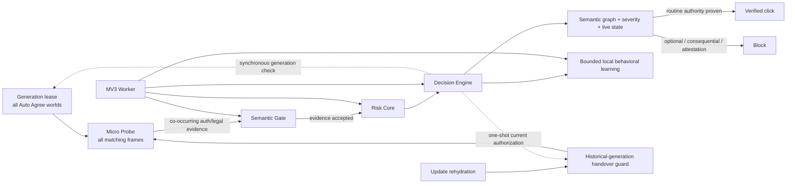

# Auto Agree

Auto Agree is a Manifest V3 Chrome extension that automatically accepts **routine mandatory access agreements**—for example Terms of Service / Privacy acknowledgements that gate login, registration, verification-code and onboarding flows—while refusing optional, consequential consent and factual attestations.

It is intentionally not a generic “click every checkbox” tool.

## Safety boundary

Auto-click is allowed only when **live evidence** classifies the action as low-discretion access consent:

- routine Terms of Service / User Agreement;
- ordinary Privacy Policy / Privacy Agreement acknowledgement;
- mandatory access/onboarding agreement with a real consent control.

It refuses marketing, cookies, remember-me, auto-renewal, payment/debit authorization, loans/credit, investment/trading authorization, insurance purchase/application, medical consent, employment contracts, e-signatures, arbitration/rights/class-action waivers, biometric/facial recognition consent, guarantees/powers of attorney, CAPTCHA, and age/identity/factual attestations.

The decision is based on **what action the user would authorize**, not what industry the site belongs to.

Language support is also fail-closed: if a language family is supported for routine assent, representative native-language optional/consequential/attestation evidence must also be able to suppress automation.

## Architecture



The always-present Probe is deliberately small and never decides consent. Richer code is injected only into the exact document/frame that earns it. Gate and Engine share one semantic base; high-consequence rules are deferred to an Engine-only risk core.

The **cooperative generation lease** is isolated-world local. It checks the current manifest generation at the programmatic click primitive and makes stale Auto Agree `.click()` calls no-ops before DOM dispatch. It does not patch the page MAIN world; trusted browser input remains normal.

The handover guard remains the compatibility firewall for historical non-cooperative generations. It blocks stale agreement-like synthetic clicks while preserving tightly bounded same-event delegation used by real custom controls. Causal delegation is bound to the exact delegated control and exact live source `Event`; `stopPropagation()` cannot extend that authority into a later task.

Bounded discovery follows one hard rule:

> **a queue/object cap is not permission to forget live semantic work.**

Probe, Gate and Engine keep their hard caps while using weak final-state recovery, FIFO preservation and live-work lifetime semantics. No repair raises the cap or falls back to an unbounded synchronous page scan.

See [Architecture](docs/architecture.md), [Decision model](docs/decision-model.md), [Security model](docs/security-model.md), and [Testing](docs/testing.md).

## Install

1. Clone or download the repository.
2. Open `chrome://extensions`.
3. Enable **Developer mode**.
4. Choose **Load unpacked**.
5. Select the [`extension/`](extension/) directory.
6. Keep site access enabled for all sites if arbitrary-site coverage is desired.

Do not run multiple independent Auto Agree installs/versions simultaneously: separate extension instances can act on the same DOM independently.

## Repository layout

```text
extension/              only load-unpacked production root
  manifest.json
  generation-lease.js   realm-local cooperative generation click authority
  bootstrap.js          always-present micro Probe
  handover-guard.js     historical-generation/update firewall
  semantic-core.js      shared bounded legal/assent semantics
  risk-core.js          Engine-only consent severity/risk semantics
  gate.js               semantic activation Gate
  engine.js             decision, verification, bounded DOM/Shadow discovery, learning
  worker.js             fair injection scheduler + restart/update persistence

tests/                  deterministic contracts + real-browser harnesses/fixtures
tools/                  deterministic packaging utility
docs/
  architecture.md
  decision-model.md
  history.md
  security-model.md
  testing.md
  decisions/            architecture decision records
  verification/         version-by-version engineering evidence
.github/workflows/ci.yml
```

Obsolete implementations are intentionally absent from the production tree. Git history preserves old source; `extension/` is not a historical museum.

## Verification

Run:

```bash
npm test
python tools/package_extension.py --check
```

The v11 release gate includes:

- coherent manifest/package + **8 runtime JavaScript generation sentinels** through `version-contract`;
- 10,188 deterministic consent/risk assertions;
- 644 multilingual semantic-fragmentation assertions;
- real unpacked-extension Chrome E2E with actual MV3 Worker and dynamic injection;
- deterministic **300-case** structural fuzz with FP=0, FN=0, duplicate=0;
- repeated Worker termination/restart and update rehydration;
- Probe/Gate saturation, including Gate deep **5 independent attempts** and a >2.4-second live-TTL discriminator;
- Engine walk saturation at `MAX_WALK_JOBS=12`;
- Engine RootBatch >3-second live-TTL preservation;
- Engine 140-sibling mutation-batch >3-second live-TTL preservation;
- Engine broad closed-Shadow saturation at `MAX_SHADOW_JOBS=8` using a plain `DIV` closed-root host;
- rejected current-Engine authorization → zero automated DOM effect while trusted input still works;
- real **v10.0.0 → v11.0.0** non-reloaded update with old/new isolated worlds simultaneously observable;
- real **v11.0.0 → v12.0.0** manifest-generation probe proving stale v11 automatic and direct isolated-world `.click()` authority is revoked while trusted input remains usable;
- 5,000-checkbox DevTools CPU profile capture;
- deterministic package verification from the full production JavaScript closure.

First clean v11 release-candidate profile on Chrome for Testing 149.0.7827.22: **200.9 ms latency / 0.1945 s TaskDuration / 168 samples**, below the broad `<1000 ms` / `<0.8 s` release ceilings.

Detailed evidence: [v11 verification report](docs/verification/v11.md).

## Site learning

Successful structure can accelerate later discovery, but cache is never click authority. The Worker preserves bounded governance: at most 256 origins, 8 flows/origin, 180-day TTL, 32 hot entries, `storage.session` + persistent `storage.local`, exact fingerprint+locator identity, serialized writes, and propagated persistence failures.

## Permissions

Only:

- `scripting`
- `storage`
- `<all_urls>` host access

No `debugger`, cookies, history, `webRequest`, downloads, proxy, clipboard, `nativeMessaging`, telemetry, remote model, network client or remote-code path is used.

`<all_urls>` is the required host scope for a tool whose stated job is to operate on arbitrary websites; rich scripts are still lazy-injected only after evidence gating.

## Development principles

1. False-positive cost is higher than false-negative cost.
2. Cache accelerates discovery; cache is never authority to click.
3. Hard resource bounds stay hard, but live correctness work needs bounded recovery rather than silent loss.
4. Mutation callbacks enqueue bounded work; they do not perform full semantic analysis.
5. Background/frozen/BFCache pages quiesce and scheduled DOM ownership stays weak.
6. No unbounded subtree stringification, wildcard page scan, polling loop, remote model or telemetry.
7. A proposed optimization is rejected when profiling or safety evidence does not justify its added complexity/permission surface.
8. A sentinel, version string, loaded module or green narrow test proves presence—not exclusive authority or preservation of unrelated invariants.
9. The packaged ZIP must contain the same production runtime closure as the canonical `extension/` root.
10. A release head is not mergeable until exact-head canonical CI and a same-SHA unpacked-E2E rerun are both green.

See [CONTRIBUTING.md](CONTRIBUTING.md) and [CHANGELOG.md](CHANGELOG.md).