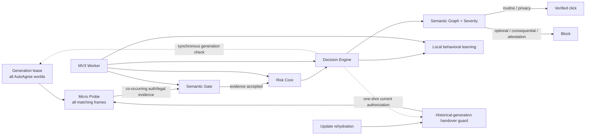

# Auto Agree

Auto Agree is a Manifest V3 Chrome extension that automatically accepts **routine mandatory access agreements**—for example Terms of Service / Privacy checkboxes that gate login, registration, verification-code, and onboarding flows—while refusing consequential consent and factual attestations.

It is intentionally not a generic “click every checkbox” tool.

## Safety boundary

Auto-click is allowed only when live evidence classifies the control as low-discretion access consent:

- routine Terms of Service / User Agreement;
- ordinary Privacy Policy / Privacy Agreement acknowledgement;
- mandatory access/onboarding agreement with a real consent control.

It refuses marketing, cookies, remember-me, auto-renewal, payment/debit authorization, loans/credit, investment/trading authorization, insurance purchase/application, medical consent, employment contracts, e-signatures, arbitration/rights/class-action waivers, biometric/facial recognition consent, guarantees/powers of attorney, CAPTCHA, and age/identity/factual attestations.

The decision is based on **what action the user would authorize**, not what industry the site belongs to.

## Architecture



The always-present Probe is deliberately small and never decides consent. Richer code is injected only into the exact document/frame that earns it. Gate and Engine share one semantic base; high-consequence rules are deferred to an engine-only risk core.

v10 adds a separate **cooperative generation lease** in Auto Agree's isolated world. Real Chrome testing showed that after a same-path extension update, an old Engine JavaScript context can remain executable while its extension Runtime is invalidated. The lease therefore checks the current manifest generation at the programmatic click primitive and makes stale Auto Agree `.click()` calls no-ops before DOM dispatch. It does not patch the page MAIN world; trusted browser input remains normal.

The v9 handover firewall remains necessary for older non-cooperative generations that never shipped this lease. It is injected before Probe rehydration and blocks stale agreement-like synthetic clicks while preserving tightly bounded same-event delegation used by real custom controls.

See [Architecture](docs/architecture.md), [Decision model](docs/decision-model.md), [Security model](docs/security-model.md), [ADR 0009](docs/decisions/0009-generation-handover-firewall.md), and [ADR 0010](docs/decisions/0010-cooperative-generation-lease.md).

## Install

1. Clone or download the repository.
2. Open `chrome://extensions`.
3. Enable **Developer mode**.
4. Choose **Load unpacked**.
5. Select the [`extension/`](extension/) directory.
6. Keep site access enabled for all sites if arbitrary-site coverage is desired.

Do not run multiple independent Auto Agree installs/versions simultaneously: separate extension instances can still act on the same DOM independently.

## Repository layout

```text
extension/              load-unpacked production extension
  manifest.json
  generation-lease.js   realm-local cooperative generation click authority
  bootstrap.js          always-present micro-probe
  handover-guard.js     update-time firewall for non-cooperative old generations
  semantic-core.js      shared bounded legal/assent semantics
  risk-core.js          engine-only consent severity/risk semantics
  gate.js               semantic activation gate
  engine.js             decision, verification, Shadow DOM, learning
  worker.js             fair injection scheduler + restart/update persistence

tests/                  deterministic contracts + real-browser harnesses/fixtures
tools/                  deterministic packaging utility
docs/
  architecture.md
  decision-model.md
  history.md
  security-model.md
  testing.md
  decisions/            architecture decision records
  verification/         version-by-version engineering evidence
.github/workflows/ci.yml
```

The old `auto-agree-extension/content.js` implementation is intentionally removed from the live tree. Git history preserves obsolete source; the production directory is not a historical museum.

## Verification

Run:

```bash
npm test
python tools/package_extension.py --check
```

v10 verification includes:

- dependency-free syntax, permission, semantic-property, generation-lease, Worker scheduler/restart and profile-governance contracts;
- 10,020 semantic severity/property assertions;
- real unpacked-extension Puppeteer E2E in Chrome for Testing;
- repeated forced MV3 service-worker termination/restart;
- real v9→v10 transition on non-reloaded dormant and already-active pages;
- simultaneous v9/v10 Engine-world diagnostics;
- exactly one current routine update click and zero stale mixed/IDREF/non-English/over-broad causal clicks;
- real 10→11 manifest-generation probe proving stale v10 automatic and direct isolated-world `.click()` calls are revoked while trusted input still works;
- real iframe and closed-Shadow regression fixtures;
- native form-validity gating, tri-state refusal and durable UNKNOWN-state one-shot regressions;
- 5,000-checkbox DevTools CPU profile capture;
- deterministic package verification from the full production JavaScript closure.

Detailed evidence: [v10 verification report](docs/verification/v10.md).

## Site learning

Successful structure can accelerate later discovery, but cache is never click authority. The Worker preserves bounded governance: at most 256 origins, 8 flows/origin, 180-day TTL, 32 hot entries, `storage.session` + persistent `storage.local`, exact fingerprint+locator identity and serialized writes.

## Permissions

Only:

- `scripting`
- `storage`
- `<all_urls>` host access

No `debugger`, cookies, history, `webRequest`, downloads, proxy, clipboard, `nativeMessaging`, telemetry, remote model, network client or remote-code path is used.

`<all_urls>` is the unavoidable host scope for a tool whose stated job is to operate on arbitrary websites; rich scripts are still lazy-injected only after evidence gating.

## Development principles

1. False positive cost is higher than false negative cost.
2. Cache accelerates discovery; cache is never authority to click.
3. Mutation callbacks enqueue bounded work; they do not perform full semantic analysis.
4. Background/frozen/BFCache pages quiesce.
5. No unbounded subtree stringification, wildcard page scan, polling loop, remote model, or telemetry.
6. A proposed optimization is rejected when profiling or safety evidence does not justify its added complexity/permission surface.
7. A sentinel, version string, loaded module or green narrow test proves presence—not exclusive authority or preservation of unrelated historical invariants.
8. The packaged ZIP must contain the same production runtime closure as the canonical `extension/` load-unpacked root.

See [CONTRIBUTING.md](CONTRIBUTING.md) and [CHANGELOG.md](CHANGELOG.md).