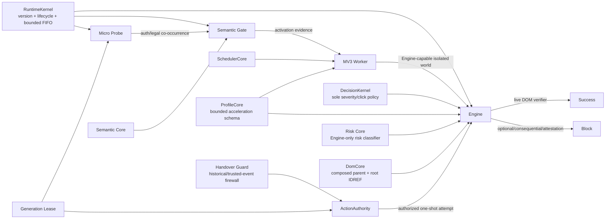

# Auto Agree

Auto Agree is a Manifest V3 Chrome extension that automatically accepts **routine mandatory access agreements**—for example Terms of Service / Privacy acknowledgements that gate login, registration, verification-code and onboarding flows—while refusing optional, consequential consent and factual attestations.

It is intentionally not a generic “click every checkbox” tool.

## Safety boundary

Auto-click is allowed only when **live evidence** classifies the action as low-discretion access consent:

- routine Terms of Service / User Agreement;
- ordinary Privacy Policy / Privacy Agreement acknowledgement;
- mandatory access/onboarding agreement with a real consent control.

It refuses marketing, cookies, remember-me, auto-renewal, payment/debit authorization, loans/credit, investment/trading authorization, insurance purchase/application, medical consent, employment contracts, e-signatures, arbitration/rights/class-action waivers, biometric/facial recognition consent, guarantees/powers of attorney, CAPTCHA, and age/identity/factual attestations.

The decision is based on **what action the user would authorize**, not what industry the site belongs to. Language support is fail-closed: every routine-supported language family is paired with native-language optional, consequential, attestation and high-consequence suppressors.

## Current architecture (v12.1)



The modules are deliberately separated by authority:

- **RuntimeKernel** owns one isolated-world birth generation, lifecycle epochs, bounded FIFO admission, live-age refresh and weak recovery primitives.
- **Generation Lease** owns cooperative stale-generation physical revocation of Auto Agree's isolated-world `HTMLElement.prototype.click`.
- **Probe** is always present but never decides consent.
- **Semantic Core** owns bounded legal/assent normalization shared by Gate/Engine/Guard.
- **Gate** decides only whether richer code is worth injecting.
- **DomCore** owns two topology-only primitives (`composedParent`, root-scoped IDREF lookup); it is forbidden from becoming a text scanner or policy layer.
- **Handover Guard** owns trusted-event causal delegation and the firewall against unauthorized historical synthetic agreement clicks.
- **ActionAuthority** is the only Engine automated-click protocol: current generation → Guard authorization → one `.click()` attempt. It does not decide semantic policy or declare DOM success.
- **DecisionKernel** is the sole severity lattice and EvidenceIR/classless acceptance authority.
- **Risk Core** classifies optional/consequential/attestation semantics using the DecisionKernel severity lattice.
- **ProfileCore** owns bounded persisted-profile schema, merge/identity/compatibility and origin/flow limits. Historical success may accelerate discovery but never creates click authority.
- **Engine** extracts live browser evidence, asks DecisionKernel for policy, invokes ActionAuthority, and separately verifies the observable DOM state.
- **SchedulerCore** owns Worker injection scheduling policy; the Worker owns Chrome APIs, transient queue execution, persistent profile storage and update rehydration.

Dynamic Engine injection is ordered so lease/semantics/DomCore/Guard/ActionAuthority/policy/profile/risk dependencies exist before Engine starts. Update protection installs the current lease + semantics + DomCore + Guard before rehydrating Probe into already-open tabs.

Bounded discovery follows one hard rule:

> **A queue/object cap is not permission to forget live semantic work.**

Probe, Gate and Engine keep hard resource caps while preserving connected final state through FIFO ownership, weak recovery and lifecycle-aware retirement. No recovery path raises a cap or falls back to an unbounded whole-page scan.

See [Architecture](docs/architecture.md), [Decision model](docs/decision-model.md), [Security model](docs/security-model.md), and [Testing](docs/testing.md).

## Install

1. Clone or download the repository.
2. Open `chrome://extensions`.
3. Enable **Developer mode**.
4. Choose **Load unpacked**.
5. Select the [`extension/`](extension/) directory.
6. Keep site access enabled for all sites if arbitrary-site coverage is desired.

Do not run multiple independent Auto Agree installs/versions simultaneously: separate extension instances can act on the same DOM independently.

## Repository layout

```text
extension/                  canonical load-unpacked production root
  manifest.json
  runtime-kernel.js         single isolated birth generation + lifecycle/bounded-work primitives
  generation-lease.js      cooperative stale-generation click revocation
  bootstrap.js             always-present micro Probe
  semantic-core.js         shared bounded legal/assent semantics
  gate.js                  semantic activation Gate
  dom-core.js              topology-only composed-parent / root-IDREF primitives
  handover-guard.js         historical-generation + trusted-event firewall
  action-authority.js       sole automated click protocol
  decision-core.js          pure EvidenceIR/classless policy + sole severity lattice
  profile-core.js           bounded persisted-profile governance
  risk-core.js              Engine-only optional/consequential/attestation classifier
  engine.js                 browser evidence extraction + verification + bounded discovery
  scheduler-core.js         pure Worker injection scheduling policy
  worker.js                 Chrome injection/storage/update adapter

tests/                      auto-discovered deterministic gates + explicit real-Chrome E2E
tools/                      deterministic packaging utility
docs/
  architecture.md
  decision-model.md
  history.md
  security-model.md
  testing.md
  decisions/
  performance/
  verification/
.github/workflows/ci.yml
```

Obsolete implementations are intentionally absent from the production tree. Git history and the verification archive preserve historical evidence; `extension/` contains only the current executable closure.

## Verification

Run:

```bash
npm test
python tools/package_extension.py --check
```

The current CI and local closeout policy have **three independent evidence classes**:

1. **core** — `tests/run-core.mjs` automatically discovers every deterministic root `tests/*.mjs` gate except `e2e-*` and itself, executes each in a fresh Node process, then runs TypeScript and deterministic package verification;
2. **unpacked-e2e** — real headed Chrome for Testing with the actual unpacked MV3 extension, Worker, dynamic injection, lifecycle/queue/Shadow/authority/update discriminators;
3. **performance** — an interleaved exact-base/exact-head real-Chrome matrix covering positive-tail, negative-idle, mutation-churn, hidden-page and multi-tab scheduler behavior, with raw samples, median/p90 ratios and absolute ceilings.

The current **12.1.0** production package identity is owned by [`release/package-manifest.json`](release/package-manifest.json):

```text
AutoAgree-v12.1.0.zip
sha256=4b2697268bac2c8da7a748bd8db9e36fb9b5d30a7459f4a7560aa794a5ed13a3
compression=stored
textEncoding=utf-8
textLineEndings=lf
```

`stored` ZIP entries make the archive independent of Python/zlib compressor versions. Canonical UTF-8/LF text members make it independent of Git checkout line-ending policy. `tests/package-reproducibility.mjs` builds it in two independent Python processes and compares both bytes and the canonical hash.

Formal closeout is executable rather than prose-only: [`release/closeout-policy.json`](release/closeout-policy.json) defines the lanes and two required same-head attempts; `npm run closeout:evidence` records exact base/head/tree, tool and Chrome identities, lane output digests, package authority and an explicitly sourced hosted-runner state; `npm run closeout:verify` validates both receipts; and `npm run closeout:merge` compares the PR head before issuing the squash merge, then reads back PR state, remote main, exact tree parity and remote head-ref deletion without switching the local worktree.

The following v12 measurements remain historical evidence for the architecture baseline; they are not the identity or performance protocol of the current 12.1 package.

The v12 release candidate physically proved:

- **27 auto-discovered deterministic gates**, including the previously omitted 6,000-case classless DecisionKernel property gate;
- DecisionKernel differential/safety testing (7,500 cases), SchedulerCore (12,500), RuntimeKernel lifecycle/queue/lifetime (5,500 generated sequences), ProfileCore/compatibility (10,500), consent-model generation (10,020 + 3,500), 23-language risk parity, and exhaustive routine/risk fragmentation samples;
- deterministic **300-case** real-Chrome structural fuzz with false positives = 0, false negatives = 0, duplicate toggles = 0;
- hard Probe/Gate/Engine saturation and live-TTL preservation, including closed ShadowRoot recovery;
- three-layer automated-action proof: rejected ActionAuthority dispatches no synthetic click; a direct isolated synthetic click is independently blocked by Handover Guard; trusted browser input remains usable;
- real **11.0.0 → 12.0.0** non-reloaded update with full old/new isolated contexts simultaneously observable;
- real **12.0.0 → 13.0.0** future-generation probe with stale automated clicks = 0, direct stale isolated `.click()` = 0, trusted click = 1;
- deterministic historical package `AutoAgree-v12.0.0.zip`, canonical candidate sha256 `1cee531a26272160df70909815089a80d1d45814ce3d138d7dd2c2efbc00e859`;
- statistical real-unpacked candidate performance on Chrome 149.0.7827.22 / Puppeteer 25.1.0 / Node 24: latency median **259.1 ms**, p90 **288.2 ms**, max **288.5 ms**; TaskDuration median **0.2524 s**, p90 **0.2803 s**, max **0.2812 s** across seven raw runs.

Hosted GitHub runners exhibit measurable execution-regime variance, so one CI profile is not treated as a deterministic cross-machine microbenchmark and does not justify speculative product optimization by itself.

Current closure protocol: [v12.1 verification report](docs/verification/v12.1.md). Historical baseline evidence: [v12 verification report](docs/verification/v12.md).

## Site learning

Learning is bounded acceleration only. Current governance is machine-enforced by ProfileCore:

- at most 256 persistent origins;
- at most 8 flows per origin;
- 180-day TTL;
- 32-entry Worker hot LRU plus `storage.session` and `storage.local`;
- validated fingerprint + exact DOM/Shadow locator identity;
- finite/bounded descriptors and timestamps;
- serialized mutations and explicit persistence failures.

Cached evidence is always revalidated against current DOM state, current semantics and DecisionKernel policy before ActionAuthority can be reached.

## Permissions

Only:

- `scripting`
- `storage`
- `<all_urls>` host access

No `debugger`, cookies, history, `webRequest`, downloads, proxy, clipboard, `nativeMessaging`, telemetry, remote model, network client or remote-code path is used.

`<all_urls>` is the host scope required for arbitrary-site coverage; rich scripts are still lazy-injected only after evidence gating.

## Development principles

1. False-positive cost is higher than false-negative cost.
2. Cache accelerates discovery; cache is never authority to click.
3. One invariant should have one policy owner; adapters may expose browser side effects but must not duplicate policy.
4. Hard resource bounds remain hard; live correctness work uses bounded recovery rather than silent loss.
5. Mutation callbacks enqueue bounded work instead of performing unbounded semantic analysis.
6. Background/frozen/BFCache pages quiesce and scheduled DOM ownership stays weak.
7. No unbounded subtree stringification, wildcard page scan, polling loop, remote model or telemetry.
8. Performance changes require repeated evidence; a single hosted-runner sample is not enough to justify complexity.
9. A sentinel/module/version or green narrow test proves only what that evidence actually covers.
10. The packaged ZIP must contain the same executable closure as `extension/`.
11. Deterministic tests self-register; adding a new root non-`e2e-*` gate must not require a second manual package-script edit.
12. A release head is mergeable only after exact-head core/full-Chrome/performance success and same-SHA rerun evidence.

See [CONTRIBUTING.md](CONTRIBUTING.md) and [CHANGELOG.md](CHANGELOG.md).
