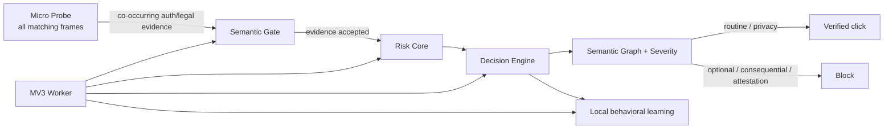

# Auto Agree

Auto Agree is a Manifest V3 Chrome extension that automatically accepts **routine mandatory access agreements**—for example Terms of Service / Privacy checkboxes that gate login, registration, verification-code, and onboarding flows—while refusing consequential consent and factual attestations.

It is intentionally not a generic “click every checkbox” tool.

## Safety boundary

Auto-click is allowed only when live evidence classifies the control as low-discretion access consent:

- routine Terms of Service / User Agreement;
- ordinary Privacy Policy / Privacy Agreement acknowledgement;
- mandatory access/onboarding agreement with a real consent control.

It refuses marketing, cookies, remember-me, auto-renewal, payment/debit authorization, loans/credit, investment/trading authorization, insurance purchase/application, medical consent, employment contracts, e-signatures, arbitration/rights/class-action waivers, biometric/facial recognition consent, guarantees/powers of attorney, CAPTCHA, and age/identity/factual attestations.

The decision is based on **what action the user would authorize**, not what industry the site belongs to.

## Architecture



The always-present probe is deliberately small and never clicks. Richer code is injected only into the exact document/frame that earns it. Gate and Engine share one semantic base; high-consequence rules are deferred to an engine-only risk core.

See [Architecture](docs/architecture.md), [Decision model](docs/decision-model.md), and [Security model](docs/security-model.md).

## Install

1. Clone or download the repository.
2. Open `chrome://extensions`.
3. Enable **Developer mode**.
4. Choose **Load unpacked**.
5. Select the [`extension/`](extension/) directory.
6. Keep site access enabled for all sites if arbitrary-site coverage is desired.

Do not run multiple Auto Agree versions simultaneously: two independent auto-clickers can toggle the same control twice.

## Repository layout

```text
extension/              load-unpacked production extension
  manifest.json
  bootstrap.js          always-present micro-probe
  semantic-core.js      shared bounded legal/assent semantics
  risk-core.js          engine-only consent severity/risk semantics
  gate.js               semantic activation gate
  engine.js             decision, verification, Shadow DOM, learning
  worker.js             fair injection scheduler + restart/update persistence

tests/                  dependency-free contract/property tests
tools/                  deterministic packaging utility
docs/
  architecture.md
  decision-model.md
  history.md
  security-model.md
  testing.md
  decisions/            architecture decision records
  verification/         immutable historical verification reports
.github/workflows/ci.yml
```

The old `auto-agree-extension/content.js` implementation is intentionally removed from the live tree. Git history preserves it; keeping dead executable-looking files in the production directory only creates ambiguity.

## Verification

Run:

```bash
npm test
python tools/package_extension.py
```

v9 verification includes:

- dependency-free syntax, permission, semantic-property and Worker scheduler/restart contracts;
- 10,020 semantic severity/property assertions;
- real unpacked-extension Puppeteer E2E in Chrome;
- forced MV3 service-worker termination/restart;
- v8→v9 update/reload transition covering both dormant old Probe and already-active old Engine pages;
- real iframe and closed-Shadow regression fixtures;
- native form-validity gating regression;
- ARIA/data/native tri-state refusal and durable UNKNOWN-state one-shot regression;
- 5,000-checkbox E2E DevTools CPU profile capture;
- deterministic ZIP integrity verification.

Detailed evidence: [v9 verification report](docs/verification/v9.md).

## Permissions

Only:

- `scripting`
- `storage`
- `<all_urls>` host access

No `debugger`, cookies, history, `webRequest`, downloads, proxy, clipboard, `nativeMessaging`, or remote-code path is used.

`<all_urls>` is the unavoidable host scope for a tool whose stated job is to operate on arbitrary websites; rich scripts are still lazy-injected only after evidence gating.

## Development principles

1. False positive cost is higher than false negative cost.
2. Cache accelerates discovery; cache is never authority to click.
3. Mutation callbacks enqueue bounded work; they do not perform full semantic analysis.
4. Background/frozen/BFCache pages quiesce.
5. No unbounded subtree stringification, wildcard page scan, polling loop, remote model, or telemetry.
6. A proposed optimization is rejected when profiling or safety evidence does not justify its added complexity/permission surface.

See [CONTRIBUTING.md](CONTRIBUTING.md) and [CHANGELOG.md](CHANGELOG.md).
