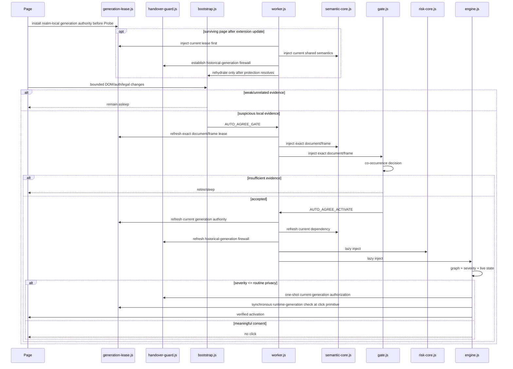

# Architecture

## System invariant

Auto Agree must minimize expected user friction **subject to a stricter constraint**: it must not convert a meaningful legal/financial/factual decision into an automatic click.

The system therefore optimizes three quantities independently:

- activation cost on unrelated frames;
- false-negative rate for routine mandatory agreements;
- false-positive rate for optional/consequential consent.

## Runtime tiers



`generation-lease.js` is always present before Probe and is also included in every dynamic Gate/Engine/update-protection dependency closure. It is intentionally tiny: it owns no discovery, semantics, timers, network activity or event listeners. Its only job is to ensure that Auto Agree's own isolated-world `HTMLElement.prototype.click()` remains usable only while `chrome.runtime.getManifest().version` matches the generation that installed the lease.

`handover-guard.js` solves a different problem. It protects pages that survive an update from **non-cooperative historical generations**, such as v9, that did not ship the resident lease. It is installed before rehydrated Probe work and uses one-shot/current-generation authorization plus a tightly bounded same-event causal delegation rule.

## Why two semantic cores

`semantic-core.js` contains only bounded normalization and the legal/assent/auth primitives required by both Gate and Engine. `risk-core.js` contains optional/consequential/attestation rules and is loaded only after Gate accepts a frame.

This avoids two failure modes:

1. duplicated Gate/Engine legal rules diverging over time;
2. loading full high-consequence semantics in every merely suspicious frame.

The handover guard also consumes `semantic-core.js`; it does not maintain a private legal/assent/required vocabulary. Its update-time semantic view therefore changes with the same bounded source of truth used by current Gate/Engine code.

Language support is treated as an authority boundary, not only a recall feature. A language family that is supported for routine Terms/Privacy assent must also have fail-closed native-language evidence for representative optional, financial, medical, biometric, rights-affecting and factual/age consent. Localized risk patterns may raise severity and suppress automation, but cannot create click authority. Both routine semantics and risk semantics use bounded compact companions so DOM fragmentation cannot create a safety asymmetry.

## Semantic graph

The Engine does not treat a checkbox label as an isolated string. Each candidate is represented by a bounded relationship graph:

```text
Control --described-by--> Semantic Row --contained-in--> Context
   |                                              |
   +---------------- gates -----------------------+--> Proceed Action
Semantic Row --references-legal--> legal links/context
```

The graph stores facts, not arbitrary DOM. Current facts include legal/assent/required, auth context, action gating, legal-link strength, control confidence, transaction context and severity.

The graph is rebuilt from live DOM evidence before activation; cached profiles cannot manufacture graph facts.

## Mutation transaction

Detailed context mutations are coalesced into a lifecycle-generation-owned transaction. Within one render burst, a context is invalidated once and its indexed candidates are re-evaluated once.

User intent events remain urgent and bypass waiting when necessary.

## Intent prewarm

No high-frequency tracking is added. Existing events contribute bounded intent evidence:

- credential focus;
- credential input/change;
- Enter;
- interaction with a proceed action.

When intent rises, Auto Agree prewarms only the current context and its candidate index.

## Lossless bounded discovery

Probe, Gate and Engine all use hard bounds and time slicing so hostile or framework-heavy DOM churn cannot create unbounded retained work. The bound applies to the **representation**, not to correctness-relevant final DOM state.

ADR 0012 defines the rule:

```text
hard queue-object cap
!=
permission to forget live semantic work
```

Current red/green-proven recovery paths are:

- Engine RootBatch pressure keeps `MAX_ROOT_BATCHES = 8`; same-parent overflow coalesces to the normal bounded `queueRoot(parent)` final-state path and mixed roots remain weakly represented.
- Probe deep pressure keeps `MAX_DEEP = 4`; evicted live roots coalesce through one `WeakRef` recovery scope and re-enter normal background traversal only after ordinary deep work drains.
- Gate batch pressure keeps `MAX_BATCH_JOBS = 6`; an evicted batch's weak live owner re-enters Gate's bounded deep path.
- Gate deep pressure keeps `MAX_DEEP_JOBS = 10`; evicted live roots coalesce weakly and re-enter normal traversal after existing batch/deep work drains. Composite evidence authority is tracked separately and is conservatively disabled when distinct scopes are merged to a broader ancestor.

All recovery state is lifecycle-owned and cleared on retirement/activation. Recovery never introduces a synchronous full-document fallback and never strongly retains a detached subtree. Static contracts reject the historical naked-drop forms, while real Chrome saturation keeps the resource caps and final activation behavior coupled in one gate.

The same rule applies to any remaining or future bounded queue: dropping a representation is valid only if its work is complete, disconnected, generation-obsolete, or another bounded recovery representation is already authoritative. Queue classes that have not yet been red-proven are not rewritten merely because their code resembles a prior defect.

## Worker injection scheduler

The service worker bounds concurrent dynamic injection:

- maximum 4 injections globally;
- maximum 2 per tab;
- queue length has a hard cap of 64;
- Engine starts with higher ordinary base priority than Gate;
- update handover rehydration uses a higher priority than ordinary Gate/Engine work;
- waiting jobs gain bounded age priority so Gate work cannot starve forever behind newly arriving Engine work;
- equal-score work rotates away from the most recently scheduled tab when another eligible tab exists;
- stale queued jobs are rejected before consuming an execution slot;
- a new Engine request can evict a younger lower-priority Gate request when the queue is otherwise full.

The queue is transient by design. If the MV3 worker is unexpectedly terminated, the content-side Probe/Gate retry path safely recreates the request rather than treating worker memory as durable authority.

## Worker lifecycle, learning and document lifecycle

`MessageSender.documentLifecycle` is a second-line injection gate. Explicit `prerender`, `cached`, or `pending_deletion` senders are rejected in the Worker even if a stale content-side callback somehow sends a message. Unknown/absent lifecycle is tolerated only for API compatibility; Chrome 120+ content-script senders normally provide the state.

Important worker state is split deliberately:

- durable: site learning and update-rehydration marker → `chrome.storage`;
- transient/replayable: in-flight injection maps, queues, LRU cache → worker globals.

The v5–v9 learning governance remains a hard invariant in v10: persistent profiles are capped at 256 origins, at most 8 flows per origin, expire after 180 days, use a 32-entry worker hot LRU plus `storage.session`/`storage.local`, and identify a flow by **fingerprint + exact DOM/Shadow locator**. Concurrent writes serialize in the Worker; persistence errors propagate to the caller rather than being reported as success.

Probe/Gate handoff messages and profile writes are idempotently replayable after unexpected worker loss. Profile storage identity is derived from Chrome `MessageSender.origin`/`url`, not from message payload text.

## Extension update rehydration

When an extension update/reload replaces the Worker, already-open pages are not assumed to have received a fresh static content script. The resumable session marker introduced in v8 remains authoritative for the sweep.

v10 rehydrates each accessible tab in two ordered phases:

1. `generation-lease.js` + `semantic-core.js` + `handover-guard.js` into all accessible frames at elevated priority;
2. `bootstrap.js` only after the protection phase resolves.

If protection fails for a tab, that tab is retried but its Probe is not started. The system therefore never intentionally creates a new discovery generation before establishing its current action boundary.

Real Chrome testing showed two distinct update facts:

- a historical old isolated-world Engine can remain observable/executable alongside the current world, so sentinels are not revocation;
- after a same-path generation replacement, the pre-existing old extension world may remain JavaScript-executable while its extension Runtime becomes invalid (`Extension context invalidated.`).

v10 exploits the second fact through the cooperative generation lease. A v10→future stale realm self-revokes its ordinary Auto Agree `.click()` primitive synchronously, before DOM dispatch. v9→v10 still requires the handover firewall because v9 never shipped that cooperative mechanism.

The guard uses two deliberately different authority scopes:

1. **Direct current-Engine authorization.** Immediately before `.click()`, current Engine authorizes the exact target/ancestor chain in the new isolated world. The click consumes that one-shot authorization. If no click event appears, unused authorization expires at the next microtask checkpoint.
2. **Local causal delegation.** A trusted user event or an already-authorized current Engine click may enter a small checkbox/control wrapper whose page handler synchronously delegates to a descendant with `.click()`. The guard maps the exact delegated control to the **exact authorizing source `Event`**. A nested synthetic click is accepted only while that source event is still in browser dispatch (`sourceEvent.eventPhase != Event.NONE`) and consumes the mapping once. Bubble cleanup remains an eager release optimization, but correctness does not depend on bubble propagation reaching the guard. Therefore `stopPropagation()` cannot extend authority into a later task. Broad form/dialog/page containers and proceed actions are never causal roots; ambiguous wrappers with multiple candidate controls fail closed.

The guard's semantic inspection is bounded and resolves explicit `aria-labelledby` / `aria-describedby` references and native external labels. It cannot use an unbounded generic descendant-control query to mint authority.

## Release-transition identity

The real-browser update harness stages the exact PR base and reads both `previousVersion` and `currentVersion` from their manifests. It does **not** encode a specific historical version pair.

Old/current isolated worlds are distinguished primarily by **execution-context identity**, not version text. This is required for same-version hotfix/reload testing, where two valid contexts may both report `10.0.0` while only one belongs to the post-rehydration generation.

## Lifecycle and ownership

Probe/Gate/Engine all quiesce on hidden/frozen/BFCache lifecycle states. Background traversal stores weak roots/cursors; no TreeWalker survives a scheduling yield. Stale lifecycle generations self-abort.

The deterministic package is derived from the complete production JavaScript set in `extension/`, rather than a second hand-maintained module list. This prevents a newly referenced runtime file such as a guard or lease from being silently omitted while a ZIP integrity check still reports success.
