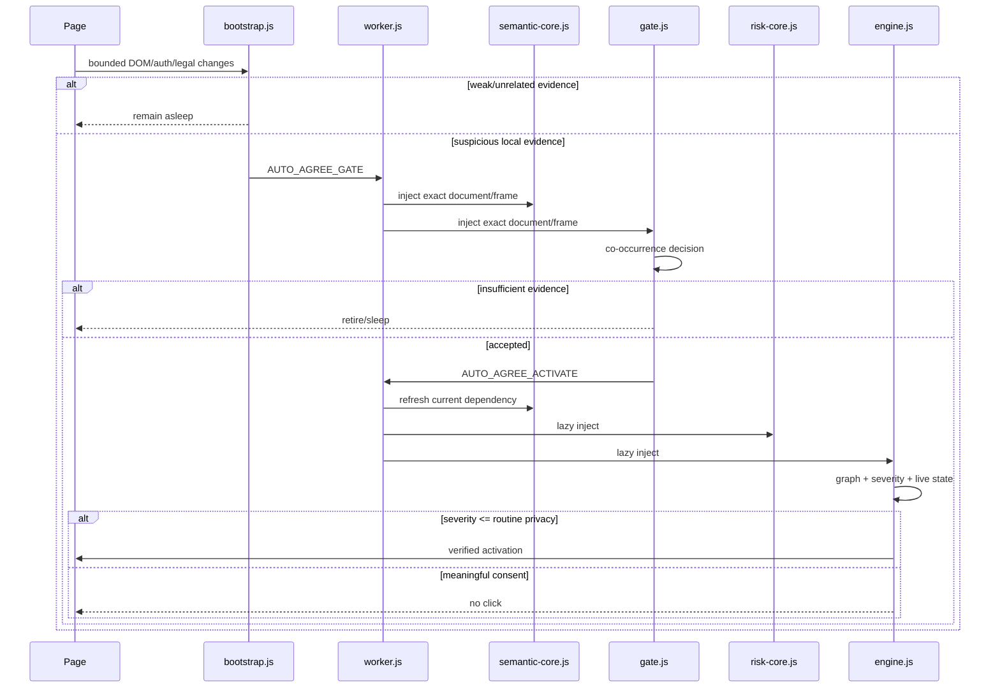

# Architecture

## System invariant

Auto Agree must minimize expected user friction **subject to a stricter constraint**: it must not convert a meaningful legal/financial/factual decision into an automatic click.

The system therefore optimizes three quantities independently:

- activation cost on unrelated frames;
- false-negative rate for routine mandatory agreements;
- false-positive rate for optional/consequential consent.

## Runtime tiers



## Why two semantic cores

`semantic-core.js` contains only bounded normalization and the legal/assent/auth primitives required by both Gate and Engine. `risk-core.js` contains optional/consequential/attestation rules and is loaded only after Gate accepts a frame.

This avoids two failure modes:

1. duplicated Gate/Engine legal rules diverging over time;
2. loading full high-consequence semantics in every merely suspicious frame.

## Semantic graph

The Engine does not treat a checkbox label as an isolated string. Each candidate is represented by a bounded relationship graph:

```text
Control --described-by--> Semantic Row --contained-in--> Context
   |                                              |
   +---------------- gates -----------------------+--> Proceed Action
Semantic Row --references-legal--> legal links/context
```

The graph stores facts, not arbitrary DOM. Current facts include legal/assent/required, auth context, action gating, legal-link strength, control confidence, transaction context and severity.

The graph is rebuilt from live DOM evidence before activation; cached profiles cannot manufacture graph facts.

## Mutation transaction

Detailed context mutations are coalesced into a lifecycle-generation-owned transaction. Within one render burst, a context is invalidated once and its indexed candidates are re-evaluated once.

User intent events remain urgent and bypass waiting when necessary.

## Intent prewarm

No high-frequency tracking is added. Existing events contribute bounded intent evidence:

- credential focus;
- credential input/change;
- Enter;
- interaction with a proceed action.

When intent rises, Auto Agree prewarms only the current context and its candidate index.

## Worker injection scheduler

The service worker bounds concurrent dynamic injection:

- maximum 4 injections globally;
- maximum 2 per tab;
- queue length has a hard cap of 64;
- Engine starts with higher base priority than Gate;
- waiting jobs gain bounded age priority so Gate work cannot starve forever behind newly arriving Engine work;
- equal-score work rotates away from the most recently scheduled tab when another eligible tab exists;
- stale queued jobs are rejected before consuming an execution slot;
- a new Engine request can evict a younger lower-priority Gate request when the queue is otherwise full.

The queue is transient by design. If the MV3 worker is unexpectedly terminated, the content-side Probe/Gate retry path safely recreates the request rather than treating worker memory as durable authority.

## Worker lifecycle and document lifecycle

`MessageSender.documentLifecycle` is a second-line injection gate. Explicit `prerender`, `cached`, or `pending_deletion` senders are rejected in the Worker even if a stale content-side callback somehow sends a message. Unknown/absent lifecycle is tolerated only for API compatibility; Chrome 120+ content-script senders normally provide the state.

Important worker state is split deliberately:

- durable: site learning and update-rehydration marker → `chrome.storage`;
- transient/replayable: in-flight injection maps, queues, LRU cache → worker globals.

Probe/Gate handoff messages and profile writes are idempotently replayable after unexpected worker loss. Profile storage identity is derived from Chrome `MessageSender.origin`/`url`, not from message payload text.

## Extension update rehydration

When an extension update/reload replaces the Worker, already-open pages are not assumed to have received a fresh static content script. v8 introduced a short-lived session rehydration marker; v9 retains it, queries existing tabs, and schedules `bootstrap.js` into all accessible frames in small batches. A worker restart during this sweep sees the marker and resumes it.

The bootstrap sentinel prevents a second Probe authority in the same document. A dormant old Probe can still talk to the new Worker; Engine activation refreshes the current semantic dependency before loading current Risk/Engine code. If an old Engine was already active before update, v9 deliberately does not install a competing Engine beside it; the old closure remains authoritative until page replacement.

## Lifecycle and ownership

Probe/Gate/Engine all quiesce on hidden/frozen/BFCache lifecycle states. Background traversal stores weak roots/cursors; no TreeWalker survives a scheduling yield. Stale lifecycle generations self-abort.
