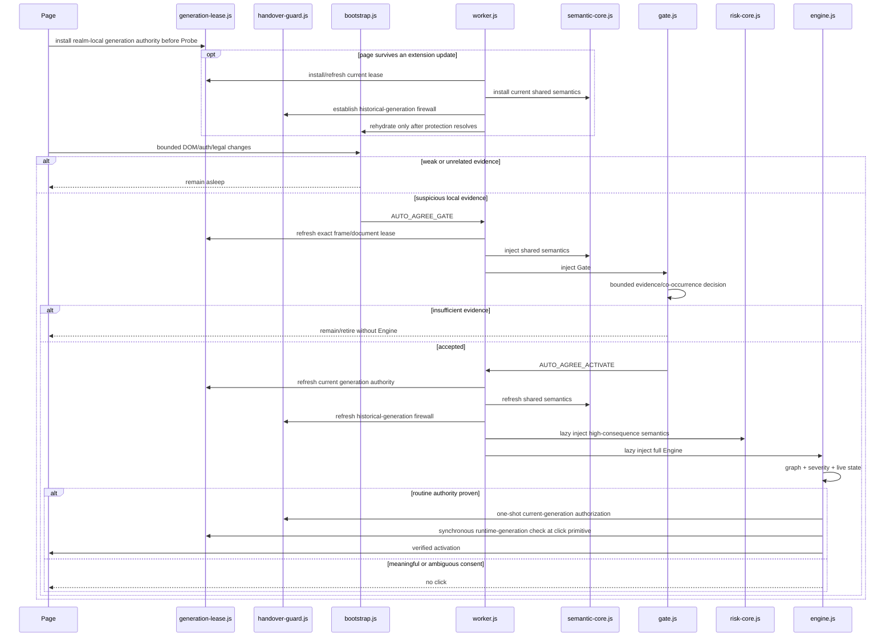

# Architecture

## System invariant

Auto Agree minimizes routine access friction **subject to a stricter constraint**: it must not convert a meaningful legal, financial, factual, optional, or attestation decision into an automatic click.

The runtime therefore treats three concerns independently:

- **cost** — unrelated frames should remain cheap;
- **recall** — routine mandatory access agreements should not be lost because of framework structure or bounded scheduling;
- **authority/safety** — optional or consequential consent and stale generations must not gain click authority.

A performance optimization is invalid if it silently weakens either recall or authority.

## Runtime generation and tiers

v11 has one coherent runtime generation across the manifest/package and eight JavaScript surfaces: Probe, Gate, generation lease, semantic core, risk core, handover guard, Engine, and Worker. `tests/version-contract.mjs` makes this a machine invariant; a mixed-generation runtime is not a valid release state.



`generation-lease.js` is present before Probe and in every dynamically injected Gate/Engine/update-protection closure. It owns no discovery, semantics, polling, network activity, or global event listener. Its single responsibility is to ensure Auto Agree's own isolated-world `HTMLElement.prototype.click()` remains usable only while `chrome.runtime.getManifest().version` matches the generation that installed the lease.

`handover-guard.js` solves a separate compatibility problem: pages can retain **historical non-cooperative isolated worlds** across an extension update. The guard protects current agreement controls from those worlds while keeping trusted user input and tightly bounded same-event page delegation functional.

## Semantic authority

### Shared semantic core and lazy risk core

`semantic-core.js` contains bounded normalization and legal/assent/auth primitives needed by Gate, Engine, and handover protection. `risk-core.js` contains optional/consequential/attestation rules and is loaded only when Gate has justified Engine activation.

This prevents:

1. Gate/Engine/handover legal vocabularies from drifting independently;
2. high-consequence semantic cost from being loaded in every merely suspicious frame.

### Multilingual safety parity

Language support is an **authority boundary**, not only a recall feature. A language family supported for routine Terms/Privacy assent must also carry fail-closed native-language evidence for representative optional, financial, medical, biometric, arbitration/rights, subscription, employment, and factual/age consent.

Localized risk patterns may raise severity and suppress automation; they cannot create authority. Routine and risk semantics both have bounded compact forms so DOM fragmentation cannot turn one side of the safety boundary into a weaker recognizer.

## Semantic graph

Engine evaluates a relationship graph rather than treating one checkbox label as an isolated string:

```text
Control --described-by--> Semantic Row --contained-in--> Context
   |                                              |
   +---------------- gates -----------------------+--> Proceed Action
Semantic Row --references-legal--> legal links/context
```

Current facts include legal/assent/required evidence, auth context, transaction context, action gating, legal-link strength, control confidence, live control state, and severity.

The graph is rebuilt from live DOM evidence before action. A learned profile can accelerate locator discovery but cannot manufacture semantic facts or click authority.

## Mutation transaction and intent prewarm

Detailed context mutations are coalesced into a lifecycle-generation-owned transaction. Within one render burst, a context is invalidated once and its indexed candidates are re-evaluated once.

Intent prewarm uses existing bounded events only:

- credential focus;
- credential input/change;
- Enter;
- interaction with a proceed action.

There is no mousemove tracking or polling loop. Rising intent prewarms only the relevant context and candidate index.

## Lossless bounded discovery

Probe, Gate, and Engine use hard queue/object caps and time slicing so hostile or framework-heavy DOM churn cannot create unbounded retained work. ADR 0012 defines the governing invariant:

```text
hard representation cap
!=
permission to forget live semantic work
```

A representation may disappear without recovery only when its work is complete, disconnected, generation-obsolete/superseded, or another bounded representation is already authoritative for the same live final state.

### Probe

`MAX_DEEP = 4` remains hard. Excess live roots are weakly coalesced into a final-state recovery scope and re-enter ordinary bounded traversal after admitted work drains. The extension does not replace the cap with a synchronous whole-document scan.

### Gate

Gate has two separately bounded representations:

- `MAX_BATCH_JOBS = 6` — large-batch pressure recovers through the batch's weak live owner and the existing bounded deep path;
- `MAX_DEEP_JOBS = 10` — existing FIFO cursors remain in place and only **new excess** live roots are weakly coalesced into final-state recovery.

Composite evidence authority is tracked separately; when distinct scopes merge to a broader recovery ancestor, composite authority fails closed rather than being widened accidentally.

`JOB_TTL_MS = 2400` is a scheduling/liveness bound, not an obsolescence oracle. Connected Gate batch/deep work crossing the age refreshes liveness and continues its existing state. Only dead/disconnected work may retire for that reason.

A deep slice that enters after its background budget is already exhausted is not considered started. `started=true` is set only when a node is actually processed, preventing the next slice from confusing a null cursor with completion.

### Engine RootBatch

`MAX_ROOT_BATCHES = 8` remains hard. Same-parent overflow coalesces to bounded `queueRoot(parent)` final-state work; mixed roots remain weakly represented rather than being silently dropped.

`ROOT_BATCH_TTL_MS = 3000` does not delete a live RootBatch by age alone. A live batch refreshes its liveness timestamp and continues from its existing `index`.

### Engine walk jobs

`MAX_WALK_JOBS = 12` remains hard. Existing FIFO walk cursors stay authoritative. A **new excess** root is weakly coalesced into `walkRecoveryRef`; recovery is promoted only after ordinary RootBatch/walk work drains. Urgency is retained separately from the weak DOM scope.

### Engine mutation/sibling batches

`MAX_BATCH_JOBS = 8` and `BATCH_JOB_TTL_MS = 3000` remain hard. Large MutationRecord NodeLists are represented as weak sibling ranges rather than retained in full.

A missing/dead owner can retire the job. A connected owner that merely crosses the TTL cannot: liveness age is refreshed and the job continues its current `currentRef`, `subjob`, and `reachedLast` state.

### Engine broad closed-Shadow discovery

`MAX_SHADOW_JOBS = 8` remains hard. Existing FIFO shadow cursors remain authoritative; new excess broad-sweep roots are weakly coalesced into `shadowRecoveryRef`.

Shadow recovery is promoted only after RootBatch, walk, mutation-batch, and ordinary shadow work drain. `hasBackgroundWork()` includes recovery, and lifecycle retirement clears it.

This path matters specifically for closed ShadowRoots on ordinary hosts that ordinary `probeShadow(host, false)` intentionally cannot open. Broad discovery may use `chrome.dom.openOrClosedShadowRoot`, but queue pressure cannot silently erase the only representation capable of discovering such a target.

### Ownership and lifecycle of recovery

All scheduled recovery state is lifecycle-owned. DOM roots/cursors are weakly held across scheduling yields; no TreeWalker is retained across a yield. Pause/freeze/BFCache retirement clears ordinary and recovery queues. No bounded-work repair introduced an unbounded synchronous fallback or a strong ownership chain to detached DOM.

## Worker injection scheduler

The Worker separately bounds dynamic code injection:

- maximum 4 injections globally;
- maximum 2 per tab;
- queue length 64;
- Engine has higher ordinary base priority than Gate;
- update protection/rehydration has higher priority than ordinary Gate/Engine work;
- waiting jobs gain bounded aging priority;
- equal-score work rotates away from the most recently scheduled tab when another eligible tab exists;
- stale queued jobs are rejected before consuming a slot;
- a high-priority Engine request can evict a younger lower-priority queued Gate request when the scheduler is full.

This queue is transient by design. Unexpected MV3 Worker termination is tolerated because Probe/Gate handoff is replayable and durable correctness state is not stored solely in Worker globals.

## Document lifecycle and profile governance

`MessageSender.documentLifecycle` is a Worker-side defense in depth. Explicit prerender/cached/pending-deletion senders cannot schedule Gate/Engine/profile work. Unknown lifecycle is tolerated only for API compatibility.

State ownership is split deliberately:

- **durable:** verified site learning and update-rehydration marker → `chrome.storage`;
- **transient/replayable:** injection queues/maps and hot cache → Worker globals.

v11 preserves the verified profile governance:

- maximum 256 persistent origins;
- maximum 8 flows/origin;
- 180-day TTL;
- 32-entry Worker hot LRU;
- `storage.session` + `storage.local`;
- flow identity = fingerprint + exact DOM/Shadow locator;
- serialized concurrent writes;
- persistence errors propagate to the caller.

Profile origin is derived from Chrome `MessageSender.origin`/`url`, never trusted from content-provided payload text.

## Extension update rehydration

An extension update can replace the Worker while already-open pages retain prior isolated worlds. v11 rehydrates each accessible tab in two ordered phases:

1. `generation-lease.js` + `semantic-core.js` + `handover-guard.js` in all accessible frames at elevated priority;
2. `bootstrap.js` only after protection resolves.

If protection fails for a tab, protection is retried and Probe is **not** started for that tab. Discovery therefore never intentionally starts before the current action boundary exists.

The formal v10→v11 real-browser transition proved that a full v10 isolated world and a full v11 isolated world can remain simultaneously observable without page reload. The current v11 world owns routine action; stale/protected negative cases remain zero-click.

The independent future-generation probe replaced the same unpacked v11 path with manifest-only v12 while keeping the page alive. The old v11 JavaScript execution context remained observable, but its generation lease reported non-current authority; stale automation and direct stale-world `.click()` both produced zero DOM clicks while trusted browser input still succeeded once.

## Click authority

### Direct current-Engine authorization

Immediately before `.click()`, current Engine asks the current handover guard to authorize the exact target/ancestor chain. Authorization is one-shot and microtask-bounded.

A real-browser negative discriminator also proves the **event boundary itself** remains fail-closed: replacing the public API object with `authorize() => false` caused two Engine attempts (initial + bounded retry) but zero DOM click effect, while a subsequent trusted browser click succeeded exactly once. Therefore v11 does not add a redundant speculative branch merely because Engine does not inspect the return value.

### Local causal delegation

A trusted user event or already-authorized current Engine click may enter a small local control wrapper whose page handler synchronously delegates to a descendant `.click()`.

Authority is bound to:

- the exact delegated control;
- the exact source `Event`;
- the live duration of browser dispatch (`sourceEvent.eventPhase != Event.NONE`);
- one consumption.

Bubble cleanup is an eager optimization, not the authority boundary. `stopPropagation()` therefore cannot preserve a token into a later task. Broad form/dialog/page containers and proceed actions are excluded; ambiguous wrappers with multiple candidate controls fail closed.

## Release-transition identity

The update harness stages the exact PR base and derives previous/current versions from their manifests. It does not hardcode a historical release pair.

Old/current worlds are identified primarily by **execution-context ID**, not version text. That supports both major transitions (v10→v11) and same-version hotfix/reload tests where two observable contexts can carry equal version strings.

## Packaging and permissions

`extension/` is the canonical production root. The deterministic package derives its executable JavaScript closure from the actual `extension/*.js` set, not from a second hand-maintained runtime list.

This means a newly referenced guard/lease/runtime module cannot be omitted while a ZIP shape/CRC check still reports success.

Permissions remain:

- `scripting`;
- `storage`;
- `<all_urls>` host access required for the product's cross-site login role.

There is no debugger permission, telemetry/network client, remote code, eval, polling interval, or wildcard whole-page scan in the production closure.
