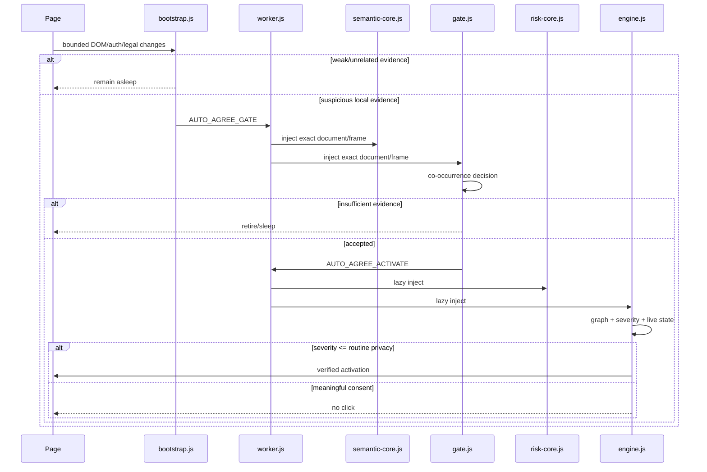

# Architecture

## System invariant

Auto Agree must minimize expected user friction **subject to a stricter constraint**: it must not convert a meaningful legal/financial/factual decision into an automatic click.

The system therefore optimizes three quantities independently:

- activation cost on unrelated frames;
- false-negative rate for routine mandatory agreements;
- false-positive rate for optional/consequential consent.

## Runtime tiers



## Why two semantic cores

`semantic-core.js` contains only bounded normalization and the legal/assent/auth primitives required by both Gate and Engine. `risk-core.js` contains optional/consequential/attestation rules and is loaded only after Gate accepts a frame.

This avoids two failure modes:

1. duplicated Gate/Engine legal rules diverging over time;
2. loading full high-consequence semantics in every merely suspicious frame.

## Semantic graph

The Engine does not treat a checkbox label as an isolated string. Each candidate is represented by a bounded relationship graph:

```text
Control --described-by--> Semantic Row --contained-in--> Context
   |                                              |
   +---------------- gates -----------------------+--> Proceed Action
Semantic Row --references-legal--> legal links/context
```

The graph stores facts, not arbitrary DOM. Current facts include legal/assent/required, auth context, action gating, legal-link strength, control confidence, transaction context and severity.

The graph is rebuilt from live DOM evidence before activation; cached profiles cannot manufacture graph facts.

## Mutation transaction

Detailed context mutations are coalesced into a lifecycle-generation-owned transaction. Within one render burst, a context is invalidated once and its indexed candidates are re-evaluated once.

User intent events remain urgent and bypass waiting when necessary.

## Intent prewarm

No high-frequency tracking is added. Existing events contribute bounded intent evidence:

- credential focus;
- credential input/change;
- Enter;
- interaction with a proceed action.

When intent rises, Auto Agree prewarms only the current context and its candidate index.

## Worker injection scheduler

The service worker bounds concurrent dynamic injection:

- maximum 4 injections globally;
- maximum 2 per tab;
- Engine jobs have priority over Gate jobs;
- queue length has a hard cap.

This prevents iframe-heavy pages from turning evidence bursts into an unbounded injection storm.

## Lifecycle and ownership

Probe/Gate/Engine all quiesce on hidden/frozen/BFCache lifecycle states. Background traversal stores weak roots/cursors; no TreeWalker survives a scheduling yield. Stale lifecycle generations self-abort.
