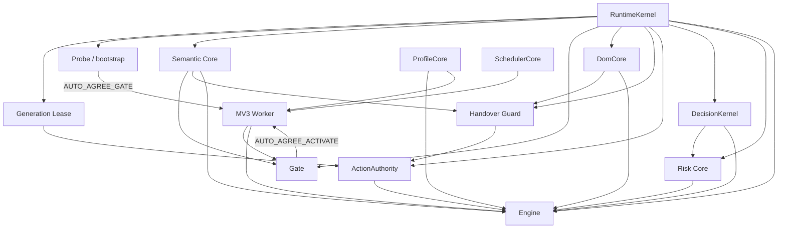

# Architecture

Auto Agree is a lazy, evidence-gated MV3 extension. The architecture is organized around **authority separation**: discovery, semantic classification, decision policy, persisted acceleration, automated action, lifecycle control and Chrome side effects are intentionally different responsibilities.

## System invariant

The product may automatically act only when current browser evidence proves a **routine mandatory access agreement**. Optional, consequential or attestation semantics are fail-closed. Historical success, CSS shape, a loaded module, a version sentinel, or a stale decision can never create click authority by itself.

## Runtime dependency graph



## Module authorities

### `runtime-kernel.js`

RuntimeKernel is the single isolated-world **birth-generation** authority and the shared browser-independent lifetime/work substrate.

It owns:

- one `VERSION` literal for the isolated execution generation;
- lifecycle epoch/state primitives used by Probe, Gate and Engine;
- bounded FIFO admission and hard capacity enforcement;
- live-age refresh semantics;
- weak final-state recovery helpers.

It does **not** own DOM semantics, consent policy, Chrome storage or Worker scheduling policy. Other isolated runtime modules snapshot `KERNEL.version`; they do not carry independent release-number literals.

### `generation-lease.js`

Generation Lease wraps the current isolated realm's `HTMLElement.prototype.click`. Immediately before dispatch it synchronously checks whether the realm's compiled RuntimeKernel generation still equals `chrome.runtime.getManifest().version`.

This is a cooperative physical revocation mechanism for Auto Agree generations that shipped the lease. It does not patch the page MAIN world and does not replace the historical-generation firewall.

### `bootstrap.js` — Probe

Probe is the always-present micro tier. It performs bounded local discovery for co-occurring authentication/legal evidence and requests Gate only when richer work is justified.

Probe never owns consent severity or click policy. Pressure recovery keeps hard queue bounds while retaining weak final-state convergence for connected work.

### `semantic-core.js`

Semantic Core owns bounded normalization and shared routine legal/assent/authentication vocabulary. Gate, Engine and Handover Guard consume it so those tiers cannot silently maintain divergent Terms/Privacy semantics.

It deliberately does not own the severity lattice; DecisionKernel is the sole severity authority.

### `gate.js` — Semantic Gate

Gate performs a bounded evidence scan after Probe activation. Its only product decision is whether the document/frame should receive the Engine-capable runtime closure.

Gate owns its low-cost text/attribute budgets and bounded traversal state. Those budgets are intentionally not unified with Engine or Guard scanners because the tiers have different latency and security obligations.

### `dom-core.js`

DomCore is a deliberately tiny topology adapter. It owns exactly two shared mechanisms:

- composed-tree parent resolution across slots / Shadow hosts;
- root-scoped IDREF lookup for Document / DocumentFragment roots.

DomCore is prohibited by static contract from becoming a TreeWalker/textContent/full-scan policy bucket. Engine and Guard still own their distinct bounded text extraction behavior.

### `handover-guard.js`

Handover Guard is the event/cross-generation firewall. It protects two cases that Generation Lease cannot collapse into one mechanism:

1. non-cooperative historical generations that never shipped a lease;
2. same-generation synthetic action that lacks a consumed current Engine authorization or a live trusted-event causal lease.

Direct Engine authorization is one-shot and expires at the next microtask checkpoint if unused. Trusted-event causal authority is bound to the exact delegated control and exact source `Event`, and remains valid only while browser dispatch is live (`eventPhase != Event.NONE`). Broad/wide containers, proceed actions and ambiguous wrappers fail closed.

A stale Guard becomes passive toward later legitimate generations after its own extension Runtime is invalidated.

### `action-authority.js`

ActionAuthority is the **single automated action protocol**, not a semantic policy engine.

For one `HTMLElement` target it requires, in order:

1. matching/current Generation Lease and `lease.current() === true`;
2. matching/current Handover Guard and `guard.authorize(target) === true`;
3. exactly one `target.click()` attempt.

Missing/mismatched dependencies, rejection or exception return `false`. The patched Generation Lease click performs another synchronous generation check at the physical primitive, closing the update race between authorization and dispatch.

ActionAuthority does not decide whether a candidate is routine and does not treat `.click()` return as success. Engine's live verifier owns observable success.

### `decision-core.js` — DecisionKernel

DecisionKernel is pure/browser-independent policy. It owns:

- the sole severity lattice: ROUTINE, PRIVACY, OPTIONAL, CONSEQUENTIAL, ATTESTATION;
- `EvidenceIR -> Decision` policy for standard controls;
- the weaker explicitly modeled classless policy path.

Engine extracts browser facts; DecisionKernel decides whether those facts can become automated action authority. Risk Core imports this severity lattice rather than defining another copy.

### `risk-core.js`

Risk Core is Engine-only and lazy. It classifies optional/consequential/attestation semantics such as marketing, financial authorization, medical consent, arbitration/waivers, biometric/facial recognition, auto-renewal and factual attestations.

Routine-language support and fail-closed risk coverage share an executable 23-family test corpus. v12 fixed Chinese `自动续费` / `自動續費` / continuous-subscription semantics so they cannot remain merely optional while other supported languages classify automatic renewal as consequential.

### `profile-core.js`

ProfileCore is browser-independent persisted-acceleration governance. It owns:

- profile/locator/descriptor sanitization;
- flow identity;
- profile merge semantics;
- descriptor compatibility;
- bounded origin-index compaction;
- resource limits: 256 origins, 8 flows/origin, 180-day TTL, 32-entry Worker hot cache.

Finite timestamps/counters and future-dated evidence are fail-closed. Semantic severity thresholds are passed from DecisionKernel instead of being duplicated here.

Profile data can nominate a likely current locator. Engine must still snapshot current DOM state, re-check compatibility/semantics/DecisionKernel policy and use ActionAuthority. Cache is never authority.

### `engine.js`

Engine is the browser adapter and verifier. It owns:

- candidate/row/context extraction;
- ARIA/native-label/Shadow evidence extraction;
- context indexing and mutation transactions;
- bounded ordinary/root/sibling/Shadow work;
- browser state reading and mixed/unknown-state handling;
- mapping browser snapshots into DecisionKernel EvidenceIR;
- profile acceleration use and learning feedback;
- ActionAuthority invocation;
- MutationObserver/event/timer-based verification that the control actually became checked.

The two automated action sites—initial attempt and one bounded retry for explicit false native/ARIA/data states—both route through ActionAuthority. Classless unknown-state controls remain one-shot.

### `scheduler-core.js`

SchedulerCore is pure Worker injection policy. It owns global/per-tab concurrency, bounded queue admission, priority aging, stale semantics, fair tab tie rotation and preemption selection.

### `worker.js`

The MV3 Worker is the Chrome API adapter. It owns:

- dynamic `chrome.scripting.executeScript` calls;
- transient injection queues whose policy comes from SchedulerCore;
- MessageSender lifecycle/origin validation;
- persistent `storage.local` + `storage.session` profile state governed by ProfileCore;
- serialized profile mutations;
- update rehydration of already-open tabs.

Worker globals are not correctness authority; the Worker may terminate between events.

## Physical injection closures

### Static content-script world

Manifest content scripts install:

```text
runtime-kernel.js
→ generation-lease.js
→ bootstrap.js
```

This runs at `document_start`, in all matching frames, in the ISOLATED world.

### Gate-capable world

Worker injection:

```text
runtime-kernel.js
→ generation-lease.js
→ semantic-core.js
→ gate.js
```

### Engine-capable world

Worker injection:

```text
runtime-kernel.js
→ generation-lease.js
→ semantic-core.js
→ dom-core.js
→ handover-guard.js
→ action-authority.js
→ decision-core.js
→ profile-core.js
→ risk-core.js
→ engine.js
```

Every consumer validates required versions before publishing its own sentinel.

### Update rehydration protection

For already-open tabs, update protection is installed before Probe recovery:

```text
runtime-kernel.js
→ generation-lease.js
→ semantic-core.js
→ dom-core.js
→ handover-guard.js
```

Only after that protection resolves does Worker inject `bootstrap.js`. ActionAuthority is Engine-only and is not needed merely to protect a historical page.

## Decision pipeline

A normal candidate proceeds through:

```text
bounded DOM evidence
→ semantic row/context + current control state
→ Risk Core severity
→ EvidenceIR
→ DecisionKernel
→ visibility/current-state revalidation
→ ActionAuthority
→ DOM event/state verifier
→ bounded ProfileCore learning feedback
```

Important asymmetries:

- DecisionKernel acceptance permits an action **attempt**, not success.
- ActionAuthority returning `true` means the authorized click primitive was invoked, not that the page honored it.
- Profile success history narrows discovery but cannot bypass live policy.
- Trusted browser input is outside Engine authorization and must remain usable.

## Lifecycle and bounded work

Probe, Gate and Engine each own domain-specific observers/listeners/queues but use RuntimeKernel lifecycle epochs. Hidden/frozen/prerender states invalidate scheduled tokens and detach/quiesce tier-owned resources. Resume creates a new current epoch and re-establishes work from live DOM rather than trusting stale asynchronous callbacks.

A bounded work item may be retired only when it is complete, dead/disconnected, generation-obsolete/superseded, or another bounded representation is already authoritative. Age alone does not delete connected work whose final state has not converged.

Current hard policies include:

- Probe deep excess → weak final-state recovery;
- Gate deep → old FIFO cursor before new excess recovery;
- Gate batch → weak live-owner recovery;
- Engine RootBatch → bounded final-state convergence and live-index preservation;
- Engine walk → old FIFO + weak excess-root recovery;
- Engine sibling range → preserve current range/subjob across live age;
- broad closed-Shadow discovery → old FIFO + weak excess-root recovery.

## Release identity

v12 has fewer independent version surfaces than the historical v11 model:

- **release metadata:** manifest + package + package-lock top-level + package-lock root package;
- **isolated-world birth generation:** the single RuntimeKernel literal;
- **other isolated modules:** derive `KERNEL.version`;
- **Worker:** derives `chrome.runtime.getManifest().version`;
- **current-generation tests:** derive the candidate manifest.

`tests/version-contract.mjs` machine-enforces this model. A release-number literal in another production module is a contract failure.

## Packaging

`extension/` is the canonical executable root. The deterministic packager derives the JavaScript closure from current production files rather than a second manual module list. Version/packaging tests therefore fail if a new runtime dependency exists in source but is omitted from the archive.

## Non-goals

Auto Agree does not attempt to control Chrome-owned UI, opaque Canvas/WebGL interfaces without usable DOM/accessibility evidence, arbitrary historical JavaScript side effects, or semantics intentionally placed outside every finite bounded sample of an unbounded string. The safety model is a tested browser/extension mechanism, not a universal browser theorem.
